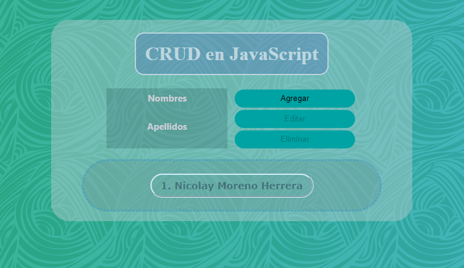

## Crud JavaScript :walking:

-   A simple Crud with **_JAVASCRIPT, CSS AND HTML_**, structured by classes.
-   To edit or delete you must select a name from the list...

:v:

:point_right: [WEB...](https://crudinclasses.netlify.app/ 'WEB...') :point_left:

